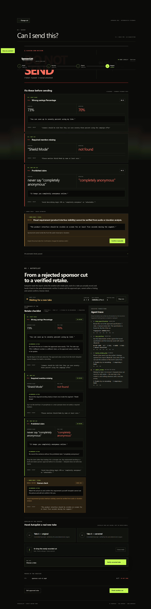

# SponsorLint

[](https://github.com/Harshyadav442277/SponsorLint/actions/workflows/ci.yml)

## A sponsor brief is a contract. SponsorLint makes it executable.

Compile a sponsor brief into a creator-approved specification, then deterministically verify the
actual recorded integration with timestamped evidence.

**AI proposes the spec. You approve it. Deterministic code enforces it.**

> **Sponsor brief → executable requirements → sponsor video → timestamped PASS / WARN / FAIL.**

```
❌ WRONG VALUE          Expected: 73%   Detected: "seventy percent"   00:43
   "You can save up to seventy percent using my link."

❌ REQUIRED MENTION     Expected: "Shield Mode"   Not found

❌ PROHIBITED CLAIM     Detected: "completely anonymous"              00:31
   "It keeps you completely anonymous online."

□  MANUAL REVIEW        "Product interface visible for at least five seconds."
                        Not confirmed: the current video shows only a static logo.

4/7 requirements passed                                        DO NOT SEND
```

---

## The problem

A sponsor brief is a contract with enumerated deliverables: exact product names, exact discount
figures, a tracked URL, mandatory disclosure, a duration window, prohibited claims. Verifying a
finished integration against it is manual — open the brief, scrub the timeline, compare the spoken
words, notice a mistake, re-edit, check again. Missing one requirement costs a revision round with
the brand, a delayed payment, or a strained relationship, and the cost is **per revision cycle**,
not once.

SponsorLint answers one question: *before I send this sponsor cut for approval, did I actually
follow the brief?*

## Input / output

```
IN    1 sponsor brief (PDF, Markdown or pasted text)
      1 recorded sponsor segment (MP4)

OUT   1 reviewed, approved machine-readable specification
      1 timestamped verification report
      1 readiness state:  DO NOT SEND  ·  REVIEW  ·  SPONSOR READY
```

---

## 60-second quickstart

**No API key. No model download. No ffmpeg. Six packages.**

```bash
git clone https://github.com/Harshyadav442277/SponsorLint.git
cd SponsorLint
python -m venv .venv && .venv/bin/pip install -r requirements-demo.txt
.venv/bin/python -m sponsorlint demo
```

On Windows use `.venv\Scripts\pip` and `.venv\Scripts\python`. Run every command from the repo root.

Watch the verdict flip when the creator fixes the three mistakes:

```bash
python -m sponsorlint demo --arc
```

```
V1   4/7 requirements passed      DO NOT SEND
V3   7/7 requirements passed      REVIEW
```

V3 passes every automated audio and duration check. Its overall state remains `REVIEW` because the
real video does not show the required product interface, and SponsorLint deliberately leaves visual
verification to a human.

Or use the browser — same zero-key path, no terminal required:

```bash
python -m sponsorlint serve
```

Open http://127.0.0.1:8000, click **Load sample campaign**, and walk the four screens.

> The demo runs the **real** verifier against a committed brief, specification and transcript.
> The approved specification and transcript fixture are committed as reproducible inputs. No
> verdict is hardcoded — change `73%` to `70%` in the review screen and the verdict changes with it.

---

## Does it actually work?

`python -m sponsorlint eval` runs every validator over 46 hand-labeled text fixtures, most of them
deliberate hard negatives, and prints what actually happened:

```
Fixtures:           46
Correct:            45
Incorrect:           1
Accuracy:        97.8%

False FAILs:         1     (reported FAIL, requirement was satisfied)
False PASSes:        0     (reported PASS, requirement was violated)
Manual Review:       1
```

**Terminology, because "false positive" reverses meaning depending on who reads it:**

```
False FAIL    reported FAIL, requirement was actually satisfied
              Cost: the creator re-edits something that was fine.

False PASS    reported PASS, requirement was actually violated
              Cost: a broken sponsor read ships to the brand.
```

Those errors are not symmetric, so the tuning policy is stated out loud: **avoid false FAILs, route
ambiguity to MANUAL REVIEW, then maximize violation catch rate.**

The single miss is a real, documented limitation, left in the fixture set on purpose — see
[Limitations](#limitations). An eval that only contains cases the tool already handles is not a
measurement.

Fixtures live in [`sponsorlint/eval/fixtures.json`](sponsorlint/eval/fixtures.json) and are the same
assertions the unit tests use — written once, used twice.

```bash
python -m sponsorlint eval --verbose   # every case, pass or miss
python -m pytest tests -q              # 425 passed, 3 skipped, 1 intentional xfail
```

---

## How it works

```
              messy sponsor brief
                      │
          ┌───────────▼───────────┐
          │ Requirement Compiler  │  ← the ONLY model call
          │ constrained → JSON    │     it never sees the transcript
          └───────────┬───────────┘
                      ▼
          ┌───────────────────────┐
          │ YOU REVIEW / EDIT     │  ← the trust boundary
          └───────────┬───────────┘
                      ▼
        spec.approved.json   +   transcript.json  (faster-whisper + ffprobe)
                      │
          ┌───────────▼───────────┐
          │ Verifier              │  DETERMINISTIC. No LLM. Pure functions.
          │ 6 validators          │
          └───────────┬───────────┘
                      ▼
              timestamped report
```

**The model proposes the specification. You own the specification. Deterministic code enforces the
approved specification.**

The compiler also normalizes whitespace and verifies that every rule and manual-review
`source_quote` literally occurs in the submitted brief. An invented citation is retried once and
then rejected; it cannot become trusted provenance.

The live requirement compiler was validated against `samples/brief.pdf` using the Gemini API with
structured output. The proposed specification was schema-validated, source-grounded, and
human-approved before deterministic verification. Model generation itself is not deterministic.

That split is the whole design, and four properties fall out of it:

| Property | Because the verifier is deterministic |
|---|---|
| **Reproducible** | Same inputs → same output, every time |
| **Auditable** | Every finding cites a transcript line *and* the brief sentence it came from |
| **Testable** | The eval harness above is only possible at all |
| **Debuggable** | Every stage is a separate command |

It also answers the objection every AI submission gets. *Isn't this just an LLM wrapper?* —
**the LLM never sees the transcript.** It reads the brief once, at compile time, and the output of
that read is a specification you can argue with before anything is checked.

### The editable spec is not decoration

The review screen shows the source sentence beside every extracted rule. You can edit, add and
delete rules, and the **approved** spec is what enters the verifier. Changing the expected discount
from `73%` to `70%` really does flip the corrected take from `REVIEW 7/7` to `DO NOT SEND 6/7`.
That is [a test](tests/test_engine.py), not a claim.

### Rule types

Six executable types. Each validator is a pure `(rule, transcript) -> Result` function.

| Type | Checks |
|---|---|
| `MUST_SAY` | A required phrase, product name or talking point appears |
| `MUST_NOT_SAY` | A prohibited phrase does not occur |
| `EXACT_VALUE` | A numeric or code-like value matches exactly |
| `MUST_DISCLOSE` | Sponsorship disclosure is present, with a timestamp |
| `DURATION` | Segment length falls inside the required window |
| `URL_OR_CTA` | The tracked URL, promo code or call to action is spoken |

Anything a validator cannot check becomes **MANUAL REVIEW** — surfaced, never dropped, never
guessed, and never counted in the score. An unresolved manual item keeps readiness at `REVIEW`;
after the creator explicitly confirms it, all passing automated checks can resolve to
`SPONSOR READY`.

### The parts that are harder than they look

- **Whisper emits digits sometimes and words other times, unpredictably, in the same transcript.**
  `73%`, `73 percent`, `seventy-three percent` and `seventy three percent` all compare equal; `70%`
  does not. A run-scanner rewrites number-words to digits in place and `EXACT_VALUE` becomes a
  boundary-guarded membership test — so `73` matches inside "seventy-three percent" but not inside
  `730`, `173`, or `73.5`.
- **A required phrase routinely straddles a Whisper segment break.** Matching per segment scores
  70.6 on `"shield mode"` split across two segments; matching the joined transcript scores 100.
  SponsorLint always matches the joined transcript and keeps an offset map to resolve a hit back to
  its timestamp. Fuzzy fallbacks must align to whole-token boundaries and may repair only an
  adjacent-letter transposition: `sheild mode` passes, while `shield model`, `shield modes`, and
  `shield mood` fail.
- **Fuzzy matching is never used for numbers, URLs or promo codes.** Those are identifiers: either
  the campaign's or someone else's. `aegisvpn.com/alex` scores 82.4 against a spoken
  `aegis.com/alex` — under threshold, but by only 7.6 points, so it is matched by pattern, not by
  similarity. A prohibited phrase is never failed on a near match either; a near match goes to
  MANUAL REVIEW, because a false FAIL is the expensive error.
- **`aegis vpn dot com slash alex`, `www.AegisVPN.com/Alex` and `aegisvpn.com/alex`** are the same
  URL. `H-A-R-S-H two zero` is `HARSH20` — and the promo-code path deliberately does *not* share the
  arithmetic number folder, which correctly turns "two zero" into `2`.
- **A closing CTA is actually checked at the closing.** `URL_OR_CTA` supports a
  `within_last_seconds` window. In the sample, the general campaign-URL rule can pass on any
  occurrence while the closing-CTA rule requires another occurrence in the final 15 seconds.
- **A negated disclosure is not a disclosure.** Narrow deterministic guards reject phrases such as
  `not sponsored by`, `isn't sponsored by`, and `not a paid partnership`.

---

## SponsorLint Autopilot

> From a rejected sponsor cut to a verified retake.

Added for the Agentic Day Online Hackathon. Everything above this section existed before it — the
pre-Autopilot baseline is commit [`8fecaf9`](https://github.com/shreshth006/SponsorLint/commit/8fecaf9e23e71af8f5580ea80b5f2c99d7b1d062).

### The problem it closes

The verifier tells you a cut is not sendable. It does not tell you *what to record instead*, and it
does not remember that you were mid-revision. The expensive part of a sponsor integration is the
revision cycle: read the report, work out which of seven requirements moved, re-record, re-run,
compare, discover you fixed two of three. Autopilot runs that loop as a bounded workflow.

### The agent loop

```
Inspect the report  →  Plan the smallest safe retake  →  Wait for a real take
        ↑                                                        │
        │                                                        ▼
   Another bounded iteration  ←  Observe & decide  ←  Run the deterministic verifier
        │
        └─→  COMPLETE (verifier said so) · NEEDS_HUMAN_REVIEW · ESCALATED (bound reached)
```

Eight explicit states — `INSPECTING`, `PLANNING`, `WAITING_FOR_RETAKE`, `VERIFYING_RETAKE`,
`NEEDS_HUMAN_REVIEW`, `COMPLETE`, `ESCALATED`, `STOPPED` — and at most **three** verification cycles
per run. Every trace line the UI shows was appended by the backend at the moment the transition
executed; `_transition` is the only function that can write one, and a test asserts it stays that
way.

### The trust boundary, unchanged

Autopilot is a workflow controller, not a second verifier and not an editor. It has four powers:
inspect a `Report`, write a checklist, call `lint.engine.run`, and decide whether to continue,
escalate or stop. It **cannot**:

| | |
|---|---|
| edit the approved specification | the run holds a deep copy plus a SHA-256 fingerprint; an edited spec **stops** the run with a 409 |
| change an expected value to match the recording | plan items copy `expected` out of the approved `Rule` — restating it is the point |
| downgrade or suppress a failure | it never assigns a status; a test rejects any assignment of `SPONSOR_READY` anywhere in the package |
| confirm a manual-review item | only an explicit human action reaches `confirm_manual_item`, and the verifier re-runs afterwards |
| edit a transcript and call it a retake | it never writes media; a take arrives from a picker or an upload |
| reach `SPONSOR_READY` by any other route | readiness is read off the report the existing resolver returned |

The fingerprint deliberately excludes each manual item's `confirmed` flag — a human confirming a
visual check is the one sanctioned mid-run change, and must not read as tampering.

### Zero-key demo

No API key, no model download, no ffmpeg, no network, no new dependency. The bundled V1 → V3
campaign produces the whole arc from its own data:

```
V1   4/7   DO NOT SEND          3 failures → a 4-item plan (3 re-record, 1 human)
V3   7/7   REVIEW               every automated rule passes; the visual item is still open
     7/7   SPONSOR READY        only after a human confirms it
```

None of those numbers are written into the agent. A test greps the whole package for `aegis`,
`shield mode`, `73%`, `70%` and the sample filenames, and fails if any appears.



### Commands

```bash
python -m sponsorlint autopilot                    # the bounded loop, V1 then V3
python -m sponsorlint autopilot --confirm-manual   # ...including the human confirmation
python -m sponsorlint autopilot --json             # the run as JSON
python -m sponsorlint autopilot --spec S --take T --take T2
python -m sponsorlint serve                        # the browser flow (canonical)
```

`autopilot` exits `0` only when the run reached `COMPLETE`; an unfinished run is a non-zero exit,
the same linter semantics `verify` uses.

Five routes back the browser flow, on the same bounded in-memory store as everything else:

```
POST /api/autopilot/start                  report → a run bound to that report's spec
GET  /api/autopilot/{run_id}               the run
POST /api/autopilot/{run_id}/verify-retake a take the creator supplied
POST /api/autopilot/{run_id}/confirm-manual a human closes one visual item
POST /api/autopilot/{run_id}/stop          end the run; a stopped run never passes
```

The run's client view carries the spec **fingerprint**, never the spec and never the transcript.

### Limitations

- **It plans; it does not act on media.** No recording, no editing, no re-cutting, no video repair
  of any kind. `WAITING_FOR_RETAKE` is a genuine stop: nothing advances until a person supplies a
  take.
- **Wording suggestions are drafts.** For a `MUST_NOT_SAY` finding it recommends removing the claim
  and says explicitly that any replacement needs sponsor approval. It will not write a stronger
  claim.
- **Three iterations, then a person.** The bound is not tunable from the browser. A run that has not
  closed by then escalates rather than looping.
- **Bound to one specification for its lifetime.** Editing the approved spec mid-run is a hard stop,
  not a migration. Approve the edit and start a new run.
- **In-memory, process-local, evicted oldest-first**, like every other store here. Restarting the
  server ends every run.
- **A `DURATION` finding is reported, not solved.** It states the approved window and by how much
  the take misses it. Length is a property of a recording.

---

## Limitations

Written by us, not discovered by you.

- **Audio and duration only.** No OCR, no logo detection, no visual verification of any kind.
  On-screen requirements are surfaced for explicit human confirmation. An unresolved item produces
  `REVIEW`; SponsorLint never claims the audio verifier checked it.
- **Disclosure matching uses five fixed phrasings** (`sponsored by`, `this video is sponsored by`,
  `paid partnership`, `today's sponsor is`, `thanks to X for sponsoring`). A creator who says
  "this is sponsored content" *has* disclosed, and SponsorLint reports FAIL. That is the one miss in
  the eval above, kept in the fixture set so the number stays honest.
- **`MUST_NOT_SAY` is a literal-phrase check, not sentiment analysis.** "Nothing is unhackable" trips
  a rule prohibiting "unhackable". Correct by the letter of the brief, and worth knowing.
- **We check the supplied brief, not the law.** SponsorLint makes no legal or regulatory claim, emits
  no regulatory language, and never invents a requirement the brief did not state. If the brief does
  not give a disclosure deadline, SponsorLint will not invent one — it asks *you* for the number on
  the review screen and reports the timestamp.
- **It does not guarantee sponsor approval** and does not replace brand review.
- **The committed transcripts remain authored fixtures.** The real V1 and V3 media have also been
  run through `faster-whisper` as candidate transcripts without manual cleanup. Those runs prove the
  audio/ASR/verifier path; candidates are not promoted automatically. See
  [`samples/README.md`](samples/README.md).
- **Local, in-memory session store.** No database, accounts, or per-user isolation. Specs and reports
  use unguessable IDs and the oldest entries are evicted, but this server should not be exposed to
  an untrusted network. Restarting it clears state.
- **Uploads are temporary, not durable storage.** Normal completion and handled failures delete the
  temporary file; a hard process or machine crash can leave an orphan in `uploads/`.

---

## Commands

```bash
python -m sponsorlint demo                       # zero-key demo, committed campaign
python -m sponsorlint demo --arc                 # DO NOT SEND → REVIEW
python -m sponsorlint autopilot                  # the bounded retake loop
python -m sponsorlint eval                       # validator metrics
python -m sponsorlint verify --spec S --transcript T
python -m sponsorlint serve                      # the web UI
python -m sponsorlint compile brief.pdf          # needs GEMINI_API_KEY
python -m sponsorlint transcribe cut.mp4         # needs faster-whisper + ffmpeg
```

The browser is the canonical full workflow because its review screen enforces the trust boundary.
There is intentionally no one-shot `analyze` command or `--yes` bypass.

`verify` uses linter exit codes: `1` on a blocking failure, `0` otherwise.

There is no packaging step, no `pip install -e .` and no `sponsorlint` console script — run
`python -m sponsorlint` from the repo root.

## Full install

Only needed for the compiler, transcription and the test suite.

```bash
pip install -r requirements.txt
```

| Extra | Needed for | Notes |
|---|---|---|
| `GEMINI_API_KEY` | `compile` and browser compilation | The compiler uses `gemini-3-flash-preview` with structured output through `google-genai`. |
| `faster-whisper` | `transcribe` and browser video upload | `base.en` on CPU. First run downloads ~140 MB. |
| `ffmpeg` on PATH | `transcribe` and browser video upload | Duration is written into the transcript at transcribe time, which is why the demo path needs no ffmpeg. |

## Deploy

The repository includes a production Docker image and a Render Blueprint. The
image runs as an unprivileged user, includes ffmpeg for real media uploads, and
exposes `/healthz` for deployment readiness checks. Render prompts for
`GEMINI_API_KEY`; never commit the key or bake it into the image.

Deploy the Blueprint from the repository, then point the root domain to
Render's load balancer and `www` to the generated `onrender.com` hostname.
The service is configured for `sponsorlint.xyz` and automatic deploys only
after GitHub checks pass.

## Provenance

SponsorLint is a two-person project. `git shortlog` is the honest record:
[@Harshyadav442277](https://github.com/Harshyadav442277) opened the repository and wrote the first
commits; [@shreshth006](https://github.com/shreshth006) wrote the majority of what is here now.
The CI badge at the top points at `Harshyadav442277/SponsorLint`, which is where the workflow was
first configured; this working tree's `origin` is `shreshth006/SponsorLint`. Both are the same
project, and neither is a re-publication of someone else's work.

The **SponsorLint Autopilot** section is the hackathon contribution, added on top of commit
`8fecaf9`. Everything else predates it.

## Layout

```
sponsorlint/
├── models.py            Pydantic contracts — every boundary
├── cli.py               command dispatch (imports gated per command)
├── normalize/           text · numbers · urls · codes — pure functions
├── lint/                the six validators + readiness resolution
├── brief/               PDF extraction · the versioned compiler prompt
├── transcript/          faster-whisper · ffprobe
├── eval/                fixtures.json + the metrics runner
├── autopilot/           the bounded retake loop — models · planner · controller
├── report/              ANSI terminal · web template context
└── web/                 FastAPI + Jinja2 + vanilla JS, no build step
samples/                 the committed Aegis VPN campaign
docs/                    Autopilot demo script · hackathon submission · Mel evidence
tests/                   429 collected tests
```

The brand, campaign, URL and promo code used by the project are fictional.
