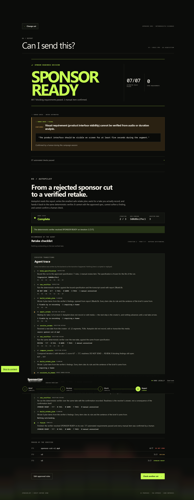

# SponsorLint Autopilot — the 75–90 second demo

> From a rejected sponsor cut to a verified retake.

Everything below runs with **no API key, no model download, no ffmpeg and no network**.

```bash
pip install -r requirements-demo.txt
python -m sponsorlint serve
# open http://127.0.0.1:8000
```

---

## The script

| t | Do this | Say this | What must appear on screen |
|---|---|---|---|
| 0:00 | Open `http://127.0.0.1:8000` | "A sponsor brief is a contract. SponsorLint already makes it executable." | The landing screen |
| 0:05 | Click **Run sample campaign** | "Here is a real brief, compiled into seven requirements." | Review screen, 7 rule cards, each citing the sentence of the brief it came from |
| 0:12 | Click **Approve 7 rules & continue** | "A human approves the spec. That has always been the boundary." | Check screen |
| 0:18 | Select **V1 — original**, click **Verify selected cut** | "This is the take the creator actually recorded." | Report screen |
| 0:24 | — | "Four of seven. Do not send." | `DO NOT SEND`, `04/07`, three FAIL cards, one human check |
| 0:30 | Scroll to **05 / Autopilot**, click **Create retake plan** | "Now the new part. The agent reads this report and plans the retake." | Agent state **Waiting for a new take**, iteration **2 / 3**, a spec-binding fingerprint |
| 0:38 | Point at the checklist | "Three things to re-record, one only a person can close. Every item restates the *approved* value — seventy-three percent — not the seventy percent that was said." | 4 plan items; `73%` vs `70%`; each item quoting the brief |
| 0:48 | Point at the trace | "Every line was written by the backend as the transition ran. There is no scripted progress here." | 4 trace events: `bind_specification`, `run_verifier`, `build_retake_plan`, `await_retake` |
| 0:55 | Select **Take 3 — corrected**, click **Verify corrected take** | "The creator records again. The agent hands it to the same deterministic verifier." | `receive_retake` → `run_verifier` → `compare_results` appear |
| 1:03 | — | "Seven of seven. But not ready." | `REVIEW`, `07/07`, agent state **Needs human review** |
| 1:10 | Point at the visual item | "The on-screen requirement is still open. The agent cannot see the picture and will not confirm it." | The manual-review card, unconfirmed |
| 1:16 | Click **Confirm manually** | "A person confirms it. The verifier re-runs and *it* decides." | `confirm_manual_item` → `run_verifier` → `finish` |
| 1:22 | — | "Sponsor ready. Rejected cut to verified retake, with the receipts." | `SPONSOR READY`, `07/07`, agent state **Complete**, 13 trace events, 3 history rows |

Terminal alternative, if a browser is not available:

```bash
python -m sponsorlint autopilot                    # stops at NEEDS_HUMAN_REVIEW, exit 1
python -m sponsorlint autopilot --confirm-manual   # reaches COMPLETE, exit 0
```

---

## Expected visible states, in order

```
INSPECTING            bind_specification · run_verifier
PLANNING              build_retake_plan
WAITING_FOR_RETAKE    await_retake                       ← nothing advances without a person
VERIFYING_RETAKE      receive_retake · run_verifier · compare_results
PLANNING              build_retake_plan
NEEDS_HUMAN_REVIEW    escalate_to_human                  ← the visual item is still open
VERIFYING_RETAKE      confirm_manual_item · run_verifier ← only a human reaches this
PLANNING              build_retake_plan
COMPLETE              finish
```

13 events. The two states a clean run never enters — `ESCALATED` (three cycles, still failing) and
`STOPPED` (operator ended it) — are reachable and tested; neither can be a passing run.

## What V1 → V3 proves

| Claim | How the demo proves it |
|---|---|
| The plan comes from real verifier output | V1's three FAILs become exactly three re-record items. Nothing that passed appears. |
| The approved value is never rewritten to match the recording | The `EXACT_VALUE` item shows Approved `73%` against This take `70%`, and tells the creator to say `73%`. |
| Findings stay auditable | All four plan items carry the sentence of the brief they came from. |
| V3 is genuinely re-verified | The `run_verifier` trace line reports `REVIEW · 7/7 · 0 FAIL`, and the report on screen is rebuilt from that run. |
| The result is not hardcoded | `tests/test_autopilot.py::test_the_corrected_takes_result_is_computed_not_assumed` feeds a *degraded* V3 and gets `DO_NOT_SEND` plus another iteration. |
| Manual review cannot be bypassed | 7/7 automated and still `REVIEW`. The agent stops at `NEEDS_HUMAN_REVIEW`. |
| `SPONSOR_READY` comes from the existing resolver | It appears only after `confirm_manual_item` and a further `run_verifier`, and the trace prints the verdict line the resolver produced. |

## What remains human-controlled

- **Approving the specification.** Unchanged. Autopilot starts from a report, which requires an
  approved spec to exist.
- **Recording the retake.** Autopilot never writes media. `WAITING_FOR_RETAKE` ends only when a
  person picks a committed take or uploads a file.
- **Confirming a visual requirement.** The only route is an explicit operator action, and the
  verifier re-runs afterwards, so the confirmation informs the verdict rather than being it.
- **Any wording change to a prohibited claim.** Suggested wording is labelled a draft needing
  sponsor approval.
- **Editing the spec.** Allowed — but it stops the run rather than continuing under new terms.

## Recovery steps

| If | Then |
|---|---|
| `That Autopilot run is no longer in memory` | The server restarted, or 100 newer runs evicted it. Re-verify the cut and click **Create retake plan** again. |
| `The approved specification changed after this Autopilot run started` (409) | Intended. Someone edited the spec mid-run. Approve the edited spec, verify a cut, start a new run. |
| The **Create retake plan** button is missing | The report is already `SPONSOR READY`; there is nothing to plan. Verify V1 instead. |
| The run reached `ESCALATED` | Three verification cycles did not close the findings. That is the bound working. Start a new run after a real fix. |
| Port 8000 is busy | `python -m sponsorlint serve --port 8017` |
| The browser shows stale styling | Assets are cache-busted with `?v=autopilot-1`; hard-reload once. |
| Nothing loads at all | `python -m sponsorlint autopilot --confirm-manual` gives the whole arc in the terminal. |


